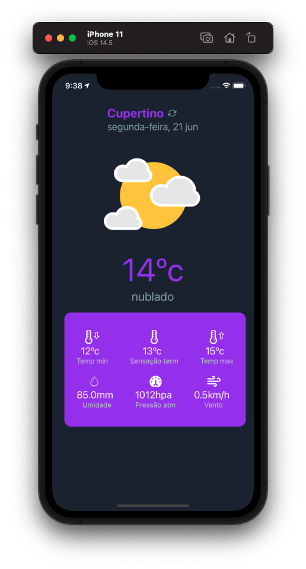

# Weather app

## Requirements

- node version 12+
- yarn or npm
- react-native-cli
- cocoaPods for iOS build
- android sdk for android build
- api key of [Weather api](https://openweathermap.org/api)

## Commands

- `yarn && cd ios && pod install && cd ..`
- `yarn start`
- On another terminal use `yarn ios` or `yarn android`
- Create a .env file on root following the .env.example

## Structure

- Components (atomic design based)[Atomic design docs](https://www.notion.so/Atomic-design-18650c7c024b4c2caec9d20ed71124d8)
- Constants (separated by entities)
- Screens (screens of app and routes)
- Services (alot of functions separated by your use, example -> locale)
- Styles (static styles props(example -> colors))
- Constants (constants of app separated by entity or screen)
- Interface (general interfaces separated by entity)

## Features

- Get weather info by latitude and longitude
- Dark and light mode
- Translated for portuguese and english
- Styled system for react native made by me :D

## ScreenShots

